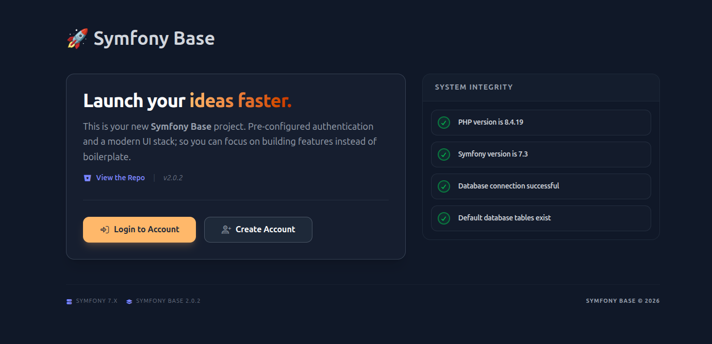
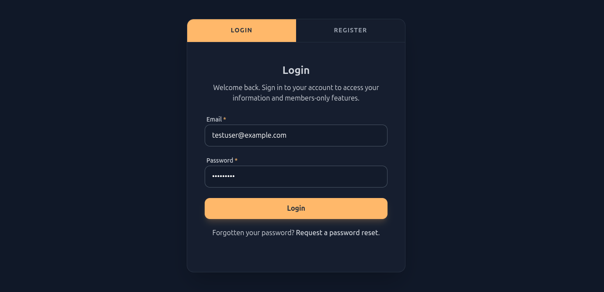
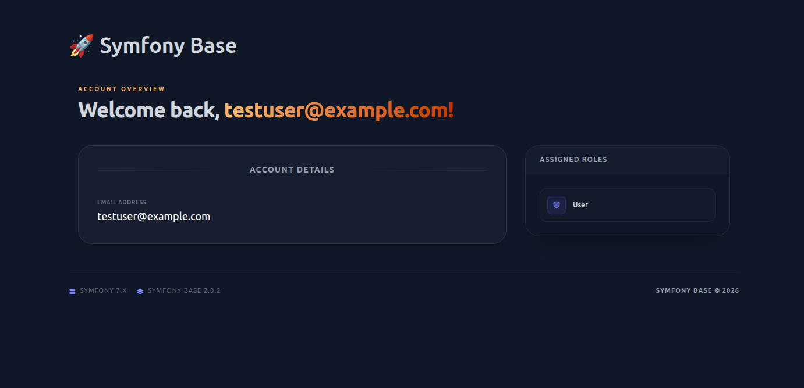
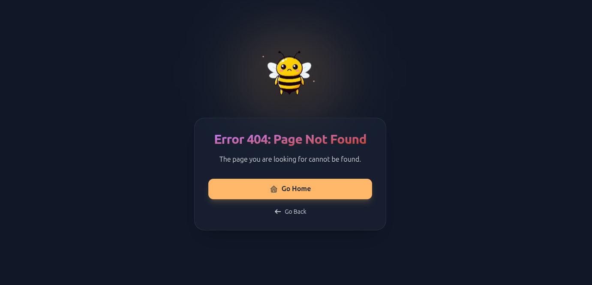

# Symfony Base Template

<p>


</p>

A **highly opinionated**, production-ready Symfony 7.3 starter template designed for rapid application development with 
a modern frontend stack.

## 🚀 Features

* **Core:** Symfony 7.3 + Doctrine ORM/DBAL.
* **Templating:** [Latte](https://latte.nette.org/) — with custom Vite integration for **Instant Live-Reload**.
* **Frontend:** Vue.js 3, Vite, TailwindCSS, TypeScript, and SCSS.
* **Auth System:** Full "out-of-the-box" flow (Login, Registration, Password Reset, Email Verification).
* **Email Builder:** A database-driven utility for generating templated HTML emails.
* **Quality Gates:** Pre-configured PHPStan (Max Level), PHP-CS-Fixer, and ESLint.






## 🛠 Installation
### Create your project
```bash
composer create-project winningsoftware/symfony-base my-project
```

This will download the Symfony Base project to a new "my-project" directory in your current working directory. 

This also runs the installer as part of the post create project command which creates the required directories, copies 
the relevant config files, cleans up unnecessary files and runs `composer install` - so you don't need to run this 
manually.
    
### Configure your environment
Update your `.env` file to suit your application/development environment. See the "Environment Configuration" section
below.

### Install JavaScript dependencies
```bash
npm install
```

### Database initialisation
```bash
php bin/console app:database:setup
# Or manually import data/setup.sql
```

## ⚙️ Environment Configuration

Before running the app, update your `.env` file with the following key variables:

| Variable             | Default / Example         | Description                                         |
|:---------------------|:--------------------------|:----------------------------------------------------|
| `APP_NAME`           | `My App`                  | The name of your application                        |
| `DEFAULT_URI`        | `http://localhost`        | Used for generating absolute URLs                   |
| `DB_HOST`            | `localhost`               | Database host (use `mysql` if using Docker)         |
| `MAILER_DSN`         | `smtp://mailcatcher:1025` | SMTP connection string                              |
| `USE_HMR`            | `false`                   | Set to `true` to enable Vite Hot Module Replacement |
| `FONTAWESOME_KIT_ID` | `abcdef1234`              | Your 10-digit FontAwesome Kit ID                    |

## 💻 Development Workflow
This template supports both local and containerized development. Choose the method that fits your environment.

### 1. Running the Project (Local)
The simplest way to get started is using PHP's built-in server:
* **Terminal A (PHP):** `php -S localhost:8000 -t public/`
* **Terminal B (Vite):** `npm run vite:dev`
* **Config:** Set `USE_HMR=true` and `DEFAULT_URI=http://localhost` in your `.env`.

### 2. Docker Setup (Recommended)
For a production-like environment, we recommend using **Docker**. A standard setup should include:
* **PHP-FPM** (8.3+)
* **Server (Nginx/Apache/Caddy etc)**
* **MySQL 8.0+**
* **Mailcatcher/Mailtrap** (for local email testing)

> If using a custom Docker setup with an HTTPS reverse proxy, use the commented-out `server` block in `vite.config.ts` 
> to map your certificates and enable `wss` for HMR. You will need to manually copy the certificate and key from your 
> reverse proxy container into the referenced locations in your PHP container.

### 3. Hot Module Replacement (HMR)
HMR is configured for both Vue/SCSS assets and Latte templates.
* **Local Dev:** The default `server` block in `vite.config.ts` works out of the box.
* **Containerized Dev:** If running over plain HTTP in Docker, ensure `server.https` is `false` and `server.hmr.protocol` 
is set to `ws`.

### 4. Quality Control
Run these commands before committing to maintain high standards:

| Tool             | Command         | Description                   |
|:-----------------|:----------------|:------------------------------|
| **PHPStan**      | `composer stan` | Static analysis (Level: Max)  |
| **PHP-CS-Fixer** | `composer cs`   | Auto-fix coding standards     |
| **ESLint**       | `npm run lint`  | Lint Vue and TypeScript files |

## 📂 Project Structure
This template uses a modular, domain-oriented structure. The `src/` directory handles PHP logic, while `assets/scripts/` 
organizes Vue components and frontend utilities into feature-based plugins.

```text
src/
├── Application/    # Domain: Where you build your app logic
├── Authentication/ # Module: Self-contained User & Security logic
├── Core/           # Internal: Base classes and framework extensions
└── Kernel.php

assets/
├── scripts/
│   ├── Core/       # Frontend utilities (ComponentLoader, FlashHandler)
│   ├── Plugin/     
│   │   ├── AppCore/         # Homepage UI (IntroCard and sub-components)
│   │   ├── AppHealthCheck/  # Health check UI components
│   │   └── AuthCore/        # Authentication UI components
│   └── app.ts      # Main JS entry point
└── styles/         # SCSS and Tailwind directives
```

## 🗄 Database Schema

This project uses a **multi-schema approach** to maintain strict separation between the Authentication system and other 
areas of your application.

The `php bin/console app:database:setup` command executes `data/setup.sql`, which creates the following:

* **`Authentication` Schema**: Contains `tblUser`, `tblVerificationToken`, and `tblPasswordResetToken`.
* **`Core` Schema**: Contains `ublEmailType` (Look-up table for email subjects and templates).

> **IMPORTANT**: Before running the setup command, review `data/setup.sql`. If your database user does not have `CREATE SCHEMA` 
> permissions, or if you prefer a different database setup, you will need to modify this script and the corresponding 
> Doctrine Entity mappings. You'll need to expose the relevant port (3000 by default) from your PHP container.

## 📧 Email System

The built-in `EmailBuilder` utility allows you to generate emails by referencing a "Handle" stored in the `Core.ublEmailType` table.

**Example Usage:**
```php
$email = $this->emailBuilder->getEmail(
    EmailType::GREET_USER,
    $user->getEmail(),
    [
        'user' => $user,
    ]
);
$this->mailer->send($email);
```

## 🛣 Available Routes

| Namespace              | Name                                    | Method       | Path                                 |
|:-----------------------|-----------------------------------------|--------------|--------------------------------------|
| **App\Core**           | `app_health_check_database_connection`  | `GET`        | `/health-check/database-connection`  |
| **App\Core**           | `app_health_check_default_tables_exist` | `GET`        | `/health-check/default-tables-exist` |
| **App\Core**           | `app_health_check_php_version`          | `GET`        | `/health-check/php-version`          |
| **App\Core**           | `app_health_check_symfony_version`      | `GET`        | `/health-check/symfony-version`      |
| **App\Application**    | `app_index`                             | `GET`        | `/`                                  |
| **App\Authentication** | `authenticate`                          | `GET`        | `/authenticate`                      |
| **App\Authentication** | `authenticate_request_password_reset`   | `GET`,`POST` | `/authenticate/password-reset`       |
| **App\Authentication** | `authenticate_password_reset`           | `GET`,`POST` | `/authenticate/password-reset/reset` |
| **App\Authentication** | `authenticate_login`                    | `GET`,`POST` | `/authenticate/login`                |
| **App\Authentication** | `authenticate_logout`                   | `GET`        | `/authenticate/logout`               |
| **App\Authentication** | `authenticate_get_logged_in_user`       | `GET`        | `/authenticate/current-user`         |
| **App\Authentication** | `authenticate_register`                 | `POST`       | `/authenticate/register`             |
| **App\Authentication** | `authenticate_verify_email`             | `GET`        | `/authenticate/verify`               |
| **App\Authentication** | `user_account`                          | `GET`        | `/user/account`                      |

> Run `php bin/console debug:router` for the full list of included endpoints.

## 🔧 Customizing

* **Homepage:** The main entry point is defined in `src/Application/IndexController.php` with the template at 
`templates/application/index.latte`. This template renders a single `IntroCard` Vue component, which acts as a wrapper 
for various internal components. You can find and modify these in `assets/scripts/Plugin/AppCore`.
* **Authentication:** All backend logic resides in `src/Authentication`. This includes Login, Registration, Password 
Reset, and Email Verification.
* **Auth UI:** For the frontend side of the built-in system, this project uses Vue components found in the 
`assets/scripts/Plugin/AuthCore` directory.
* **Styles:** Global styles, Tailwind directives, and SCSS variables are managed in `assets/styles/app.scss`.

## 🐳 Docker & Advanced Setup

The recommended approach for a production-like environment is a containerized setup (PHP, Nginx, MySQL, and Mailcatcher).

If you are using a custom Docker setup, ensure you update the `server` block in `vite.config.ts` to use the commented out 
section. If you're using HTTP instead of HTTPS inside your containers, remove `server.https` and `server.hmr.protocol` to 
`ws`.